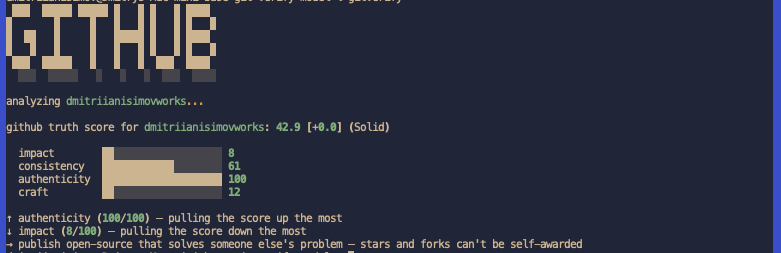

# gitverify

A self-hosted CLI that scores your own GitHub profile's authenticity from
public signals — commits, PRs, issues, releases, CI, ownership — instead of
a self-reported resume. Runs locally with your own OAuth login; nothing is
sent anywhere except GitHub's API.

The score is split into 4 axes, weighted by how hard each is to fake:

- **impact** (0.35) — stars/forks, a signal the account owner doesn't control
- **consistency** (0.30) — account age, activity spread over time, server-timestamped events
- **authenticity** (0.20) — owned repos vs forks
- **craft** (0.15) — CI, tests, releases

Bands: `Strong` (≥70) / `Solid` (≥35) / `Thin` (below).

## Install

```
uv tool install .
```

(or `pipx install .` if your `pipx` base interpreter isn't broken)

## Usage

Just run it:

```
gitverify
```

First run walks you through GitHub's device flow — it opens your browser,
you enter a code, done. The token is cached at
`~/.config/gitverify/token`. From then on, `gitverify` authenticates
automatically and analyzes the account you're logged in as — no handle to
type, no token to create by hand.

Every run is saved to `~/.config/gitverify/history.json`, so re-running
later shows a delta (`[+2.3]` / `[-1.1]`) against your last score.

```
gitverify auth login    # authenticate (or re-authenticate)
gitverify auth logout   # clear the cached token
gitverify --json        # machine-readable output, no banner
```

CI/scripting without an interactive browser: set `GITHUB_TOKEN` (scope
`read:user`) and it's used instead of the device flow.

## Development

```
pip install -e .
python -m gitverify
```
